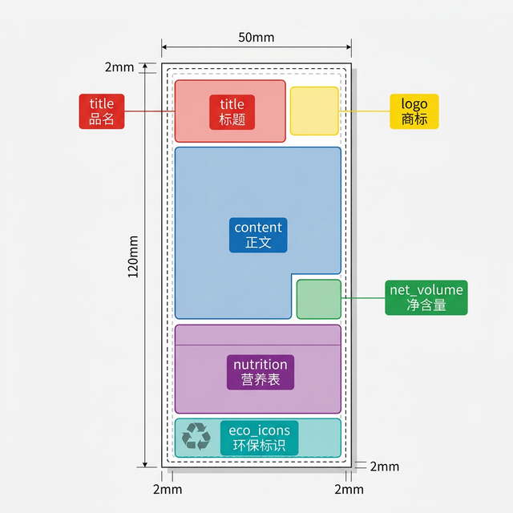

# 标签模板区域标注规范

## 目的

为实现标签内容的自动化排版，需要设计师在每个标签模板的 `.ai` 源文件中，用 **彩色矩形** 标注各功能区域的位置。程序将自动读取这些矩形的坐标，生成排版配置文件。

---

## 标注方法

### 操作步骤

1. 在 Illustrator 中打开标签模板 `.ai` 文件
2. **新建一个图层**，命名为 `区域标注`（便于后续隐藏/删除）
3. 在该图层上，用 **矩形工具 (M)** 画出每个功能区域的边界
4. 为每个矩形设置对应的 **填充色**（见下方颜色表）
5. 填充设置 **不透明度 50%** 以便能看到底层内容
6. **无描边**（Stroke: None）
7. 保存 `.ai` 文件

### ⚠️ 注意事项

- 矩形必须使用 **纯填充色**，不要用渐变或图案
- 每种颜色只能用 **一次**（每个区域只有一个矩形）
- 矩形之间 **不要重叠**
- 四周需预留 **2mm 出血位**（矩形不要画到页面边缘）
- 保存时保持标注图层 **可见**

---

## 颜色对照表

| 颜色 | RGB 值 | 区域名称 | 说明 |
|:----:|--------|---------|------|
| 🔴 **红色** | R:255 G:0 B:0 | **title** 标题 | 产品名称区域 |
| 🔵 **蓝色** | R:0 G:0 B:255 | **content** 正文 | 配料表、储存条件、产地、进口商等文字区域 |
| 🟢 **绿色** | R:0 G:180 B:0 | **net_volume** 净含量 | 净含量数字区域（如 500mL、2.27kg）|
| 🟣 **紫色** | R:180 G:0 B:180 | **nutrition** 营养表 | 营养成分表区域 |
| 🟡 **黄色** | R:255 G:255 B:0 | **logo** 商标 | 品牌 Logo / 商标图片区域 |
| 🔹 **青色** | R:0 G:180 B:180 | **eco_icons** 环保标识 | 回收标识、环保认证图标区域 |

> **提示**：颜色不需要完全精确，程序会自动识别最接近的标准色。只要颜色大方向对即可（红就是红，蓝就是蓝）。

---

## 标注示意图

下图展示了一个 50×120mm 小标签的标注示例：

---

## 常见布局类型

### 类型 A：单栏竖版（如 50×120mm 小标签）

从上到下依次标注：
- 🔴 title（顶部，可能是 L 型，右上角留给 🟡 logo）
- 🔵 content（中部大面积）
- 🟢 net_volume（右侧小块）
- 🟣 nutrition（下部表格）
- 🔹 eco_icons（底部图标区）

### 类型 B：双栏横版（如 80×70mm 背标）

左右分栏标注：
- 🔴 title（顶部横跨左半栏）
- 🔵 content（左栏）
- 🟢 net_volume（右上角）
- 🟣 nutrition（右栏，包含营养表及附注文字）

---

## 不需要标注的区域

以下区域 **无需标注**，程序会自动处理：
- 页面边框 / 出血线 / 裁切线
- 背景色
- 条形码（如有需要后续扩展）

---

## 交付要求

请将标注完成的 `.ai` 文件直接交付即可。程序运行后会自动生成：
1. `.yaml` 配置文件（区域坐标数据）
2. `_zones.png` 预览图（可用于校验）

如有疑问请联系开发团队。
