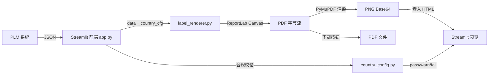

# 小标签页面布局逻辑

> 本文档梳理了 70×69mm 出口合规小标签的完整页面布局逻辑，涵盖物理尺寸体系、内容分区方案、双渲染管线以及自适应字号算法。

---

## 1. 物理尺寸体系

| 参数 | 值 | 说明 |
|------|------|------|
| 裁切尺寸 | 70 × 69 mm | 印刷裁切线 |
| 出血位 | 四周 2mm | 安全边距 |
| 内容安全区域 | 66 × 65 mm | 实际可排版区域 |

**单位换算**（`label_renderer.py` 中的常量）：

```
LABEL_W = 70mm ≈ 198.4pt
LABEL_H = 69mm ≈ 195.6pt
MARGIN  = 2mm  ≈ 5.67pt
```

---

## 2. 内容分区方案

标签内容从上到下划分为 **A / B / C** 三个主区域：

```
┌─────────────────────────────────────────┐
│ 2mm 出血位                               │
│  ┌──────────────────────────────────┐   │
│  │ [区域 A] 标题区                    │   │
│  │  英文品名 (粗体)      [Logo 右上] │   │
│  │  中文品名 (粗体)                  │   │
│  ├──────────────────────────────────┤   │
│  │ [区域 B] 全宽文字信息区            │   │
│  │  Ingredients: xxxxxxx            │   │
│  │  Contains: xxxxxxx               │   │
│  │  Storage: xxxxxxx                │   │
│  │  Production date / Best Before   │   │
│  ├────────────┬─────────────────────┤   │
│  │ [区域 C-左] │ [区域 C-右]          │   │
│  │ 38% 宽度   │ 62% 宽度            │   │
│  │            │                     │   │
│  │ Product of │ ┌─Nutrition Info──┐ │   │
│  │ Mfr:       │ │ Per serving NRV%│ │   │
│  │ Address:   │ │ Energy   25kJ 0%│ │   │
│  │ Imported:  │ │ Protein  0.8g 2%│ │   │
│  │            │ │ ...             │ │   │
│  │            │ └─────────────────┘ │   │
│  │ Net Volume │                     │   │
│  │ (左下角大号)│                     │   │
│  └────────────┴─────────────────────┘   │
│ 2mm 出血位                               │
└─────────────────────────────────────────┘
```

### 2.1 区域 A — 标题区（顶部）

- **英文品名**：粗体，字号由 `_FIXED_TITLE` 控制（cap height 2.1mm → ~8.10pt）
- **中文品名**：粗体，字号由 `_FIXED_CN` 控制（cap height 2.6mm → ~10.03pt）
- **Logo**：固定在右上角，宽 40pt，高 5.4mm
  - 标题文字和 Ingredients 需要避让 Logo 区域（`logo_reserve = LOGO_W + LOGO_PAD`）

### 2.2 区域 B — 全宽文字信息区（中部）

从上到下依次排列以下字段：

1. **Ingredients:**（配料表）— 使用 `ingr` 字号
2. **Contains:**（致敏原）— 使用 `body` 字号
3. **Storage:**（贮存条件）— 使用 `body` 字号
4. **Production date / Best Before**（日期）— 使用 `body` 字号，粗体

**排版规则**：
- 冒号前字段名加粗（如 `Ingredients:`, `Contains:`）
- 所有文本支持自动换行（`_draw_wrapped_text`）
- 前几行若在 Logo 区域内，可用宽度减去 `logo_reserve`

### 2.3 区域 C — 双栏区（底部）

| 属性 | 左栏（38%） | 右栏（62%） |
|------|-----------|------------|
| 内容 | 厂商信息 | 营养成分表 |
| 对齐方式 | 左对齐，从上往下 | 表格，从上往下 |

**左栏元素**（从上到下）：
- `Product of [origin]`（粗体）
- `Manufacturer: xxx`
- `Address: xxx`
- `Imported by: xxx`
- **Net Volume**（固定在左下角，baseline 在 `bottom` 出血线上，字号固定 19pt，超宽时横向压缩 `Tz`）

**右栏元素**：
- 营养成分表（`_draw_nutrition_table`），格式为三列表格：
  - 列1（48%）：项目名
  - 列2（30%）：Per serving 值
  - 列3（22%）：NRV%
- 标题行 + 粗线分隔 + 列标题行（两行高）+ 数据行

**左栏动态 gap 算法**：
1. 计算右栏营养表总高度 → `right_h`
2. 计算左栏各元素累计高度 → `left_content_h`
3. 富余空间 = `right_h - left_content_h`
4. 分配给左栏元素之间的间隔：`left_gap = 富余空间 / 间隔数`（最小 1pt）

**目标**：左栏元素均匀分布，使左右两栏底边对齐。

---

## 3. 双渲染管线

系统存在两套独立的渲染管线，分别用于不同目的：

### 3.1 前端预览管线（`label.html`，**已弃用/备用**）

```
PLM JSON → app.py (Jinja2 渲染) → label.html
→ PDFMake (浏览器端生成 PDF) → PDF.js (渲染到 Canvas)
```

- 使用 **PDFMake** 在浏览器端生成 PDF
- 字号由简单的文本长度分档决定（`calcFontSizes`）
- 布局为线性流式排列，营养表在品名下方、厂商信息在底部
- 当前 `app.py` 中 **不再调用** 此管线

### 3.2 服务端 PDF 管线（`label_renderer.py`，**当前主渲染管线**）

```
PLM JSON → app.py → generate_label_pdf() [ReportLab Canvas]
→ pdf_to_png_base64() [PyMuPDF] → 嵌入预览 HTML
```

- 使用 **ReportLab Canvas** 在服务端以精确坐标绘制 PDF
- 三阶段自适应字号算法（见下文）
- PyMuPDF 将 PDF 渲染为 216 DPI 的 PNG 预览图
- 预览图通过 base64 嵌入 HTML，在 Streamlit 中显示

**关键调用链**：
```
app.py → generate_label_preview_html(data, country_cfg)
            ├→ generate_label_pdf(data, country_cfg)  → PDF bytes
            └→ pdf_to_png_base64(pdf_bytes)           → PNG base64
```

---

## 4. 三阶段自适应字号算法

> 实现位置：`label_renderer.py` → `_calc_font_sizes()`

### 4.1 字号上下限

| 字号类别 | 最大值 (pt) | 最小值 (pt) | 说明 |
|---------|-----------|-----------|------|
| `title` | 8.10 | 8.10 | **固定**，英文标题 |
| `cn`    | 10.03 | 10.03 | **固定**，中文标题 |
| `body`  | 12 | 4 | 正文（Contains/Storage/日期/厂商） |
| `ingr`  | 11 | 4 | 配料表 |
| `nut`   | 5.94 | 5.94 | **固定**，营养表 |
| `net`   | 19 | 19 | **固定**，Net Volume |

标题、营养表、Net Volume 的字号**始终固定**，只有 `body` 和 `ingr` 会自适应缩放。

### 4.2 阶段1+2：二分搜索最佳字号

```
scale ∈ [0.0, 1.0]
每个字号类 = SIZE_MIN + (SIZE_MAX - SIZE_MIN) × scale
```

- 使用 `_estimate_content_height()` 估算全部内容所需高度
- 二分搜索（20 次迭代）找到最大 `scale` 使得总高度 ≤ 可用高度
- 同时检查国家法规最小字号约束

### 4.3 阶段3：横向压缩

当最小字号仍放不下时：
- 锁定字号为最小值（`scale = 0.0`）
- 二分搜索横向压缩比例 `h_scale ∈ [0.7, 1.0]`
- 通过 PDF 操作符 `Tz`（Text Horizontal Scaling）实现
- 字更窄 → 同一行放更多字 → 总高度减少

### 4.4 高度估算公式

`_estimate_content_height()` 按以下顺序累加各区域高度：

```
总高度 = ascent偏移
       + 区域A（标题 + 中文名）
       + 区域B（Ingredients + Contains + Storage + 日期）
       + 区域C（max(左栏高度, 右栏营养表高度)）
```

---

## 5. 合规校验

> 实现位置：`country_config.py` → `validate_font_compliance()`

| 校验级别 | 条件 | 行为 |
|---------|------|------|
| ✅ `pass` | 物理字高 ≥ 最低要求 × 1.2 | 允许下载 PDF |
| ⚠️ `warn` | 最低要求 ≤ 字高 < 最低要求 × 1.2 | 警告提示，允许下载 |
| ❌ `fail` | 字高 < 最低要求 | 错误提示，**禁止下载** |

字高换算公式：`物理高度(mm) = 字号(pt) × 0.3528`

---

## 6. 字体系统

**优先级**：
1. **阿里巴巴普惠体** (`Alibaba-PuHuiTi-Regular.ttf` / `Bold.ttf`) — 支持中英文
2. **NISC18030** (`NISC18030.ttf`) — GB18030 中文字体降级
3. **Helvetica** — ReportLab 内置降级（不支持中文）

**模拟加粗**：当没有独立 Bold 字体文件时，通过 PDF 描边模式（`2 Tr`）模拟加粗效果。

---

## 7. 文件架构总览

```
60-ai_tag/
├── app.py                  # Streamlit 前端 + 主控逻辑
├── label_renderer.py       # 服务端 PDF 渲染引擎（ReportLab）
├── country_config.py       # 国家配置注册表 & 合规校验
├── templates/
│   └── label.html          # 前端 PDFMake 模板（备用管线）
├── static/
│   ├── Alibaba-PuHuiTi-Regular.ttf
│   ├── Alibaba-PuHuiTi-Bold.ttf
│   └── logo_placeholder.png
├── 设计规范.md              # 设计师提供的视觉规范
├── 需求.md                  # 原始业务需求
└── 小标签需求文档.md         # 综合需求文档
```

---

## 8. 数据流


